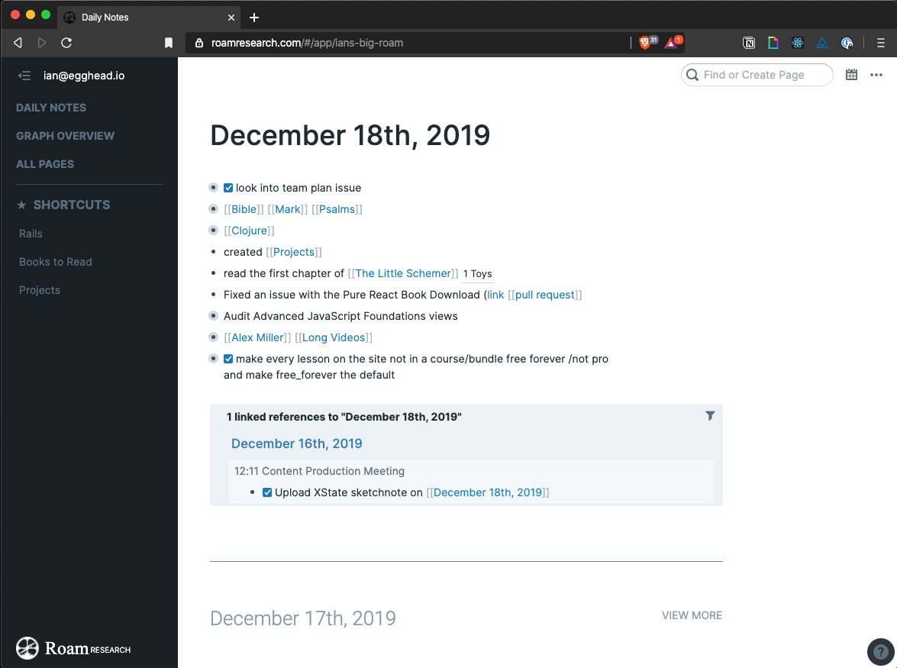
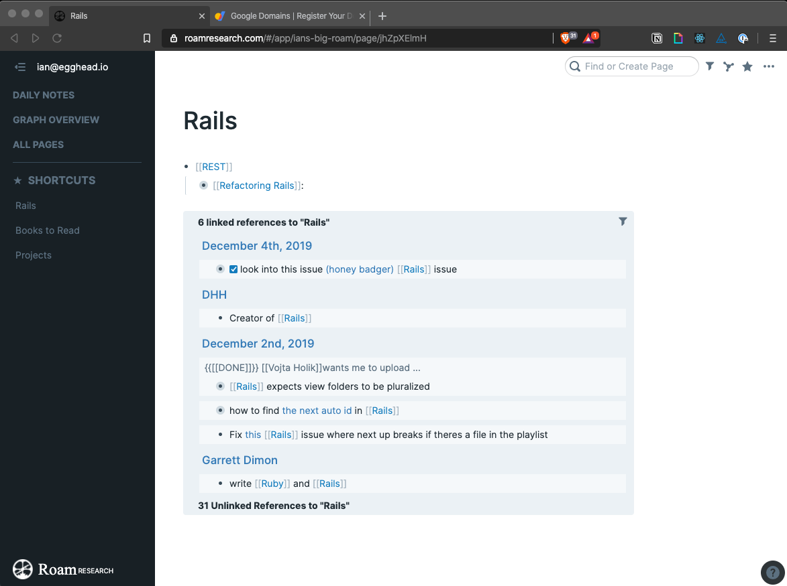

RoamResearch.com is a tool that I have been using for the past couple weeks as a sort of daily log/research tool. It as completely changed what I expect out of a note taking tool. The best part is its easy of use. Theres zero friction to start recording your thoughts on a topic.

I keep track of everything I do in the "Daily Log".

There are handy short cuts for mark down syntax and everything.

Roam is a networked not taking app :exploding_head:

When ever you get to some topic you want to reference, you can add around the string to create a page. Now that you've created a page, you can reference that page from anywhere.

For example, I use rails for work, so Ive created a `[[Rails]]` tag.

This is the page that Roam created for me:

This page gives you a place to put any content you want around this tag. You'll notice that you can reference other tags on this page. If you shift-click the tag, it opens that page in the sidebar:

This is the networked aspect of Roam. It allows you to easily navigate through your notes. I can see this being an amazing tool for researching a topic to write about or just generally keep your notes in.
