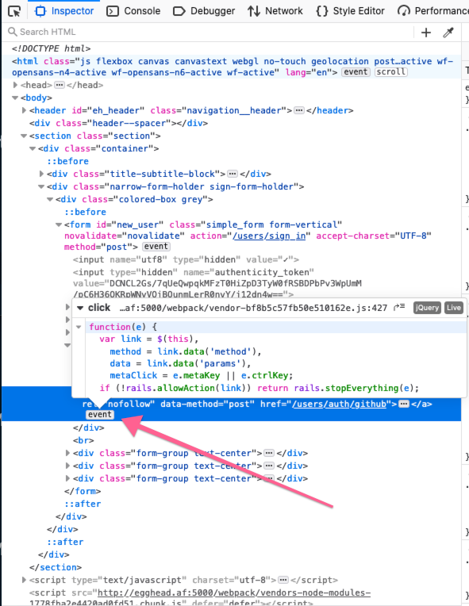

At egghead, we just implemented a new login screen in React. We use Ruby on Rails as our backend so this meant converting our old `users/sessions/new.html.erb` file to a React component.

Or old `erb` page had a "Log in with Github" button backed by [`omniauth-github` (github link)](https://github.com/omniauth/omniauth-github).

Without getting into the implementation details too much, `omniauth` generates a callback url that you are supposed to visit to kick off the oauth process.

Theres an outstanding issue (since May 25, 2015 😱) with `Omniauth` and `Rails` where you need to `POST` to the `omniauth_authorize_url` rather than `GET`ing it (read more in this [github thread](https://github.com/omniauth/omniauth/pull/809)). This is the key information here.

We ran into the issue where we would link directly to `omniauth_authorize_url` from our react component. The problem with this is that it would use a `GET`. Resulting in a `CSRF detected` error.

I went down the rabit hole of trying to see if omniauth was deleting the oauth state from the session or if the session wasn't recording it at all. None of things panned out and I just wasted a lot of time. The main take away was that you needed to make sure that if you had an `initializers/omniauth.rb` that you weren't also setting your omniauth config in your `initializers/devise.rb` file.

There was a lot of advice out there about setting `provider_ignores_state: true`.

🚨Do Not Do This🚨

This sets you up for CSRF attacks ([more about it here](https://homakov.blogspot.com/2012/07/saferweb-most-common-oauth2.html)).

After getting frustrated trying to get the callback to work within react, I thought, lets just link to an `erb` page and click the oauth generated `a` tag with good ol' jQuery.

```
<%- if devise_mapping.omniauthable? %>
  <%- resource_class.omniauth_providers.each do |provider| %>
    <%= link_to omniauth_authorize_path(resource_name, provider), id: "github_passthrough",
method: :post, :class => '' do %>
      <% if provider.to_s.titleize == "Github" %>
        Sign in with <%= provider.to_s.titleize %>
      <% end %>
    <% end %>
  <% end -%>
<% end -%>

<script type="text/javascript" charset="utf-8">
  $(function() {
    $('#github_passthrough').click()
  })
</script>
```

This is the code that I tried first.

This clicks the "Sign in with Github" button when the html loaded. This worked for half of the tests that I made. I would try visit the url, then get the `CSRF detected` error. Visit the url again and be logged in successfully. I then went down another sessions rabbit hole, thinking that I missed something important... Turns out, you need to wait for all the javascript to load 😭

I opened up Firefox to test another browser. Thats when I noticed the event handler that was attached to the link.



Heres the contents of the event handler:

```js
function(e) {
  var link = $(this),
    method = link.data('method'),
    data = link.data('params'),
    metaClick = e.metaKey || e.ctrlKey;
  if (!rails.allowAction(link)) return rails.stopEverything(e);

  if (!metaClick && link.is(rails.linkDisableSelector)) rails.disableElement(link);

  if (rails.isRemote(link)) {
    if (metaClick && (!method || method === 'GET') && !data) {
      return true;
    }

    var handleRemote = rails.handleRemote(link);
    // Response from rails.handleRemote() will either be false or a deferred object promise.
    if (handleRemote === false) {
      rails.enableElement(link);
    } else {
      handleRemote.fail(function() {
        rails.enableElement(link);
      });
    }
    return false;

  } else if (method) {
    rails.handleMethod(link);
    return false;
  }
}
```

After throwing in some `debugger` statements to see what was happening, I found that `rails` would be undefined _some of the time_.

I needed to wait for all of the assets to be loaded before making the request.

The fix ended up being:

```html
<script type="text/javascript" charset="utf-8">
  $(window).load(function () {
    $('#github_passthrough').click()
  })
</script>
```

## Resources

- https://github.com/omniauth/omniauth-oauth2/issues/95
- https://github.com/omniauth/omniauth/pull/809
- https://aaronparecki.com/oauth-2-simplified
- https://www.varonis.com/blog/what-is-oauth/
- https://homakov.blogspot.com/2012/07/saferweb-most-common-oauth2.html
