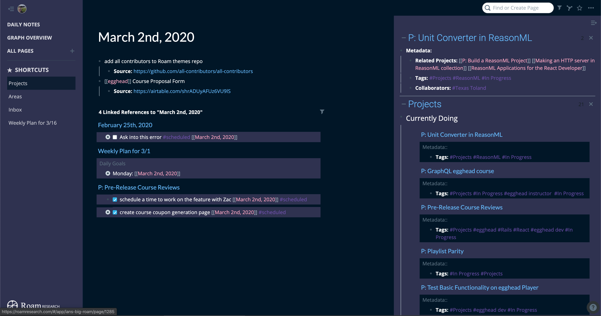

You can write your own custom [RoamResearch.com](https://roamresearch.com/) themes using [the stylus extension in chrome](https://chrome.google.com/webstore/detail/stylus/clngdbkpkpeebahjckkjfobafhncgmne?hl=en). [Maggie Appleton](https://maggieappleton.com/) has came up with the idea to override the styles with your own.

I've been maintaining a Night Owl theme (s/o to [Sarah Drasner for the original colors](https://github.com/sdras/night-owl-vscode-theme)).

I put [these themes up on github](https://github.com/theianjones/roam-research-themes) if you want to create your own or take mine!

## Resources

- https://roamresearch.com/
- https://chrome.google.com/webstore/detail/stylus/clngdbkpkpeebahjckkjfobafhncgmne?hl=en
- https://maggieappleton.com/
- https://github.com/sdras/night-owl-vscode-theme
- https://github.com/theianjones/roam-research-themes
