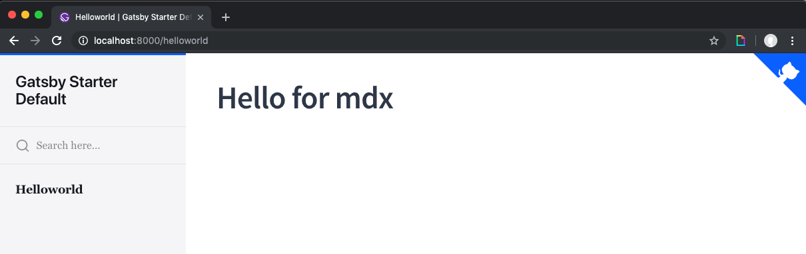
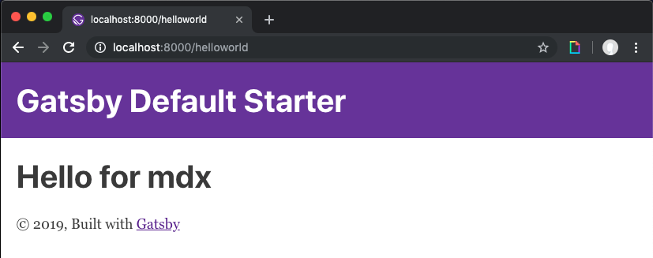

## What is a Gatsby Theme

Themes allow you to package up the functionality of any gatsby site in a sharable and extenible way.

> Themes are NPM installable Gatsby sites - Chris Biscardi

Gatsby themes are not just visual paint to a gatsby site or a preset design like a wordpress or hugo theme.

## Why would you use a Gatsby theme

A Gatsby theme can be many different things:

- preset, configurable `gatsby-config`
- ui theme (dark mode vs light mode)
- data sourcing (from contentful, json files etc)
- component library

You can install as many themes in one gatsby site as you need. When you are developing themes, you can use themes in your gatsby config as well. Themes allow you to seperate your code into different parts easily.

## How to use a theme (docz)

Generate a new site and install `gatsby-theme-docz`.

```bash
npx gatsby new docz-theme-example
cd docz-theme-example && yarn add gatsby-theme-docz
```

Add the theme to your gatsby config:

```js
// gatsby-config.js
module.exports = {
  __experimentalThemes: ['gatsby-theme-docz'],
}
```

Head over to your `src/pages` directory and add an [`mdx`](https://github.com/mdx-js/mdx) file.

```markdown
// src/pages/helloworld.mdx

# Hello from MDX!
```



Now, you can spin up your gatsby site:

```bash
gatsby develop
```

Now visit localhost:8000/helloworld or whatever you called your new file. The docz theme will generate a page for each `.mdx` file in your project.

Since you are in an mdx file, you can import any React component and use it

```js
// src/pages/helloworld.mdx
import Layout from '../Components/Layout'

export default ({ children }) => <Layout>{children}</Layout>
```

Now you will see the default `<Layout/>` wrapping your `mdx` file.



## More Resources

- [Official Intro to Gatsby Themes](https://www.gatsbyjs.org/blog/2018-11-11-introducing-gatsby-themes/)
- [Chris Biscardi's Theme Example](https://github.com/ChristopherBiscardi/gatsby-theme-examples)
- [Kyle Gill's simple guide to Gatsby Themes](https://medium.com/@kyle.robert.gill/a-simple-guide-to-gatsbyjs-themes-a4f9765c5ac7)
- [MDX docs](https://github.com/mdx-js/mdx)
- [gatsby-theme-docz](https://github.com/pedronauck/docz/tree/master/core/gatsby-theme-docz)
