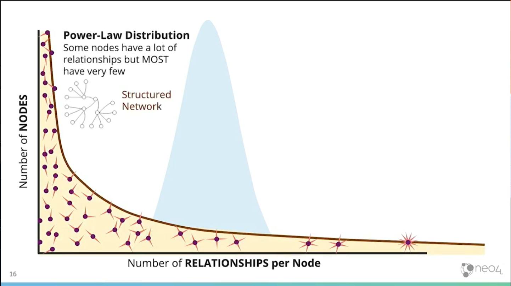
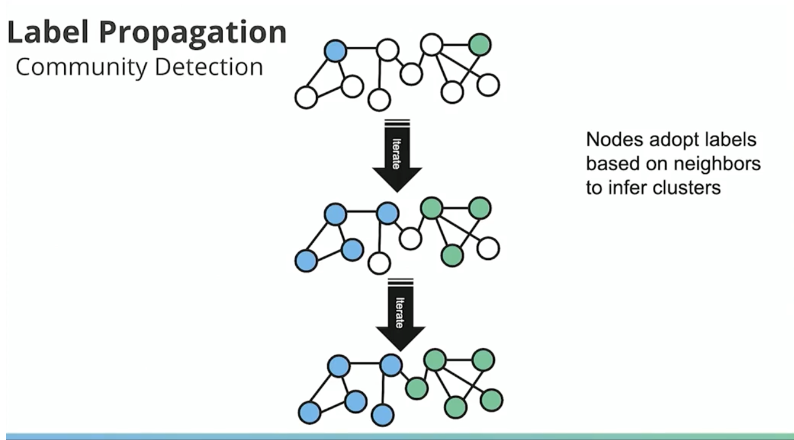

<iframe
  width="560"
  height="315"
  src="https://www.youtube.com/embed/Z6V242UPQSo"
  frameborder="0"
  allow="accelerometer; autoplay; encrypted-media; gyroscope; picture-in-picture"
  allowfullscreen
/>

Data in a graph isn't a bell curve. Its in the Power-law distribution. There are usually lots of nodes with few relationships and some nodes with lots of relationships.

> Many approaches erroneously focus on the average population where few entities actually exist.

Graphs help you invest in populated areas.

Graphs are good at:

- pathfinding and search
- centrality / importance
- community detection (understanding)
- link prediction
- similarity

[Free copy of graph algorithms book!](http://neo4j.com/graph-algorithms-book)

Graph algorithms allow you to sort categories of data into buckets.
This talk gives an example using the yelp public dataset and how Will went for sorting things by 100s of categories down to 15 greater categories.
Will used an overlap similarity algorithm in neo4j to determine the categories that would be more general (one with more nodes) than one that is specific.

2 general approaches building a recommendation system:

_content based vs collaborative filtering_

In their example, they want photo based recommendations.

1. Similar photos using Jaccard similarity
2. clustering similar photos using label propagation (community detection)

3. recommend businesses connected photos in the same community

They used googles vision api to get text labels for photos.

When things share a lot of labels, they are "similar to" each other.

Ask user for photos that they "like". Then neo4j finds the communities those photos belong to and the businesses that are connected to those photos.

[Exploratory graph algorithms app.](http://install.graphapp.io)

Triangles and clustering coefficients can be used for predictive relationships.

## Resources

- [neo4jsandbox.com](https://neo4jsandbox.com)
- [applied graph algorithms online training](https://neo4j.com/graphacademy/online-training/applied-graph-algorithms/)
- [data science with neo4j online training](https://neo4j.com/graphacademy/online-training/data-science/)
- [Graph Algorithms book (free)](http://neo4j.com/graph-algorithms-book)
- [neo4j.com/online-summit (October 2019)](https://neo4j.com/online-summit)
